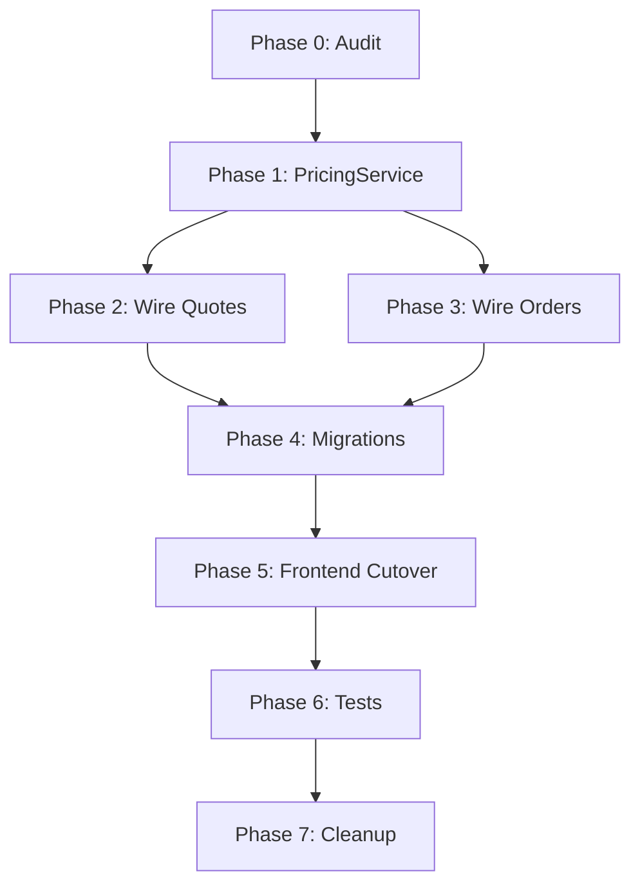

# PBV2 Pricing Cutover Audit

**Date**: 2026-02-10  
**Objective**: Audit all pricing code paths to enable complete cutover to PBV2-only pricing for Quotes and Orders

---

## Executive Summary

QuoteVaultPro currently has **dual pricing systems** (legacy + PBV2) running in parallel. This audit documents all components that must be modified or removed to achieve PBV2-only pricing.

**Key Findings**:
- ✅ PBV2 evaluator exists and is functional (`server/services/optionTreeV2Evaluator.ts`)
- ⚠️ Legacy pricing code is deeply embedded in `/api/quotes/calculate` (lines 3131-3700+)
- ⚠️ Order line items already have PBV2 fields, but quotes do NOT
- ⚠️ Products table has multiple legacy pricing fields that can be removed
- ⚠️ Frontend has dual options panels (legacy + PBV2) in use

---

## 1. Pricing Endpoints Inventory

### Primary Pricing Endpoint
**Location**: `server/routes.ts:3131`  
**Route**: `POST /api/quotes/calculate`  
**Used By**: Both Quotes AND Orders (orders call this same endpoint)  
**Current Logic**:
- Lines 3131-3250: Input parsing and normalization
- Lines 3250-3320: PBV2 detection (`schemaVersion === 2`)
- Lines 3320-3380: Material pricing resolution (LEGACY)
- Lines 3380-3450: Pricing profile selection (LEGACY)
- Lines 3450-3650: Formula evaluation or flat goods calculator (LEGACY)
- Lines 3650-3850: Legacy options pricing addition (LEGACY)
- Lines 3850-3950: Sides option special handling (LEGACY)
- Lines 3950-4000: **PBV2 evaluation** (`evaluateOptionTreeV2`)
- Lines 4000+: Response formatting

### PBV2 Evaluator
**Location**: `server/services/optionTreeV2Evaluator.ts`  
**Function**: `evaluateOptionTreeV2(input) -> result`  
**Input Shape**:
```typescript
{
  tree: OptionTreeV2,
  selections: LineItemOptionSelectionsV2,
  width: number,
  height: number,
  quantity: number,
  basePrice: number
}
```
**Output Shape**:
```typescript
{
  optionsPrice: number,
  selectedOptions: SelectedOptionsSnapshotEntry[],
  visibleNodeIds: string[]
}
```

**Current Usage**: Called ADDITIVELY after legacy pricing (basePrice computed by legacy, then PBV2 adds to it)

---

## 2. Line Item Price Computation Points

### Quote Line Items
**Table**: `quote_line_items`  
**Current Fields**:
- `unit_price` (decimal) - per-unit price
- `total_price` (decimal) - quantity × unit_price
- `selected_options` (jsonb) - LEGACY snapshot
- `option_selections_json` (jsonb) - PBV2 selections (client-supplied)
- ❌ **MISSING**: `pbv2_tree_version_id`
- ❌ **MISSING**: `pbv2_snapshot_json`
- ❌ **MISSING**: `priced_at`

**Quote Creation Flow**:
1. Client calls `/api/quotes/calculate` with dims/qty/selections
2. Server returns `price` (total) and `breakdown`
3. Client divides by quantity to get unit_price
4. Client posts to `/api/quotes/:id/line-items` with unit_price + total_price
5. Server accepts client-supplied prices (NO SERVER REPRICING)

### Order Line Items
**Table**: `order_line_items`  
**Current Fields**:
- `unit_price` (decimal)
- `total_price` (decimal)
- `selected_options` (jsonb) - LEGACY snapshot
- `option_selections_json` (jsonb) - PBV2 selections
- ✅ `pbv2_tree_version_id` (varchar)
- ✅ `pbv2_snapshot_json` (jsonb)

**Order Creation Flow**:
1. Client calls `/api/quotes/calculate` (same endpoint as quotes)
2. Server returns price
3. Client posts to `/api/order-line-items` with prices
4. Server accepts client-supplied prices (NO SERVER REPRICING)

**⚠️ CRITICAL ISSUE**: Both quotes and orders accept client-supplied prices without server validation

---

## 3. Legacy Fields Audit

### Products Table (`products`)
**Legacy Fields to REMOVE**:
- `pricing_formula` (text) - mathjs formula evaluation
- `pricing_formula_id` (varchar) - FK to `pricing_formulas` table
- `pricing_profile_key` (varchar) - "default" | "flat_goods" | "qty_only" | "fee"
- `pricing_profile_config` (jsonb) - profile-specific configuration
- `primary_material_id` (varchar) - FK to `materials` table (used only for pricing)
- `use_nesting_calculator` (boolean) - legacy flat goods pricing
- `sheet_width` (decimal) - for nesting calculator
- `sheet_height` (decimal) - for nesting calculator
- `options_json` (jsonb) - LEGACY inline options with pricing

**PBV2 Fields to KEEP**:
- `pbv2_active_tree_version_id` (varchar) - FK to `pbv2_tree_versions`
- `option_tree_json` (jsonb) - currently used for BOTH legacy detection AND PBV2 tree storage (NEEDS CLEANUP)

**⚠️ SCHEMA ISSUE**: `option_tree_json` is overloaded:
- Legacy products: `optionTreeJson: { schemaVersion: 2, nodes: {...} }` (inline tree)
- PBV2 products: Should use `pbv2_active_tree_version_id` pointer instead

### Pricing Formulas Table (`pricing_formulas`)
**Status**: Entire table can be REMOVED  
**Current Usage**: Product builder allows assigning formulas; used in `/api/quotes/calculate`

### Quote Line Items Table (`quote_line_items`)
**Legacy Fields**:
- `selected_options` (jsonb) - LEGACY snapshot (array of {optionId, value, cost})

**Fields to ADD**:
- `pbv2_tree_version_id` (varchar, FK to pbv2_tree_versions)
- `pbv2_snapshot_json` (jsonb)
- `priced_at` (timestamptz)

**Fields to MODIFY**:
- `option_selections_json` (jsonb) - rename or clarify as PBV2-specific

### Order Line Items Table (`order_line_items`)
**Legacy Fields**:
- `selected_options` (jsonb) - can be removed
- `nesting_config_snapshot` (jsonb) - legacy flat goods, can be removed

**PBV2 Fields** (already exist):
- ✅ `pbv2_tree_version_id`
- ✅ `pbv2_snapshot_json`
- ✅ `option_selections_json`

---

## 4. PBV2 Evaluator Assessment

### Existing Implementation
**File**: `server/services/optionTreeV2Evaluator.ts`  
**Status**: ✅ Fully functional  
**Capabilities**:
- Validates option tree structure
- Evaluates conditional visibility (`applyWhen`)
- Computes option pricing based on `priceMode`
- Returns snapshot suitable for persistence
- Handles quantity, dimensions, basePrice

### Current Limitations
1. **Additive Only**: Expects `basePrice` from legacy pricing
2. **No Tree Version Resolution**: Caller must provide tree
3. **No Product Context**: Doesn't load product or determine tree version
4. **No Organization Scoping**: Caller handles tenant context

### Required Enhancements for PricingService
1. Accept `productId` + `orgId` instead of raw tree
2. Resolve `pbv2ActiveTreeVersionId` from product
3. Load tree from `pbv2_tree_versions` table
4. Handle pbv2Override logic (from `pricingProfileConfig`)
5. Compute `basePrice` from PBV2 tree base pricing (not legacy)
6. Return full `PricingOutput` with tree version ID + snapshot

---

## 5. Current Request/Response Shapes

### POST /api/quotes/calculate - Request
```json
{
  "productId": "prod_xxx",
  "variantId": "var_xxx",
  "width": 24,
  "height": 36,
  "quantity": 10,
  "selectedOptions": { "opt1": { "value": "choice1" } },  // LEGACY
  "optionSelectionsJson": {                                // PBV2
    "schemaVersion": 2,
    "selected": { "node1": { "value": "choice1" } }
  },
  "customerId": "cust_xxx",
  "quoteId": "quote_xxx"
}
```

### POST /api/quotes/calculate - Response
```json
{
  "price": 450.00,  // TOTAL (not per-unit)
  "breakdown": {
    "basePrice": 300.00,
    "optionsPrice": 150.00,
    "total": 450.00,
    "selectedOptions": [  // LEGACY snapshot
      {
        "optionId": "opt1",
        "optionName": "Lamination",
        "value": true,
        "setupCost": 25.00,
        "calculatedCost": 150.00
      }
    ]
  }
}
```

### Issues with Current Shape
1. ❌ No `pbv2TreeVersionId` in response
2. ❌ No `pbv2SnapshotJson` in response
3. ❌ `selectedOptions` array is LEGACY format
4. ❌ `breakdown` mixes legacy + PBV2 pricing
5. ❌ Response doesn't distinguish which pricing system was used

---

## 6. Frontend Pricing UI Components

### Quote Add Item Modal
**File**: `client/src/features/quotes/editor/components/LineItemBuilder.tsx`  
**Current State**: ✅ Already has PBV2 support  
**Renders**:
- `ProductOptionsPanelV2` if `isPbv2Product(product)`
- `ProductOptionsPanel` (legacy) otherwise

### Order Add Item Modal
**File**: `client/src/components/order-line-item-dialog.tsx`  
**Current State**: ✅ Already has PBV2 support (added in recent changes)  
**Renders**:
- `ProductOptionsPanelV2` if `isPbv2Product(product)`
- `ProductOptionsPanel` (legacy) otherwise

### Order Line Items Section (Enterprise)
**File**: `client/src/components/orders/OrderLineItemsSection.tsx`  
**Current State**: ✅ Already has PBV2 support (added in recent changes)  
**Renders**:
- `ProductOptionsPanelV2` if `isExpandedTreeV2`
- `ProductOptionsPanel` (legacy) otherwise

### Legacy Components to REMOVE
1. `ProductOptionsPanel` (client/src/features/quotes/editor/components/ProductOptionsPanel.tsx)
2. All references to `optionSelections: Record<string, OptionSelection>`
3. All legacy option rendering code

---

## 7. Pricing Profile System (LEGACY)

### Files Involved
- `shared/pricingProfiles.ts` - profile definitions
- `server/routes.ts:23` - import and usage throughout `/api/quotes/calculate`
- Products table columns: `pricing_profile_key`, `pricing_profile_config`

### Profile Types
1. **default** - mathjs formula evaluation
2. **flat_goods** - nesting calculator for cut vinyl
3. **qty_only** - simple quantity × unit price
4. **fee** - flat fee per item

### Dependencies
- `NestingCalculator.js` (server) - JS implementation for flat goods
- Material pricing resolution (retail/wholesale/base rates)
- Formula evaluation via `mathjs`

### Removal Impact
- All products must have `pbv2_active_tree_version_id` set
- Products without PBV2 tree CANNOT be added to quotes/orders
- Pricing profiles UI in product builder becomes obsolete

---

## 8. Material Pricing Integration (LEGACY)

### Current Flow
1. Product has `primaryMaterialId` FK
2. Server loads material from `materials` table
3. Extracts `retailBaseRate`, `wholesaleBaseRate`, or `costPerUnit`
4. Applies customer tier (retail/wholesale)
5. Uses as `p` variable in pricing formula
6. Formula: e.g., `p * sqft * quantity + setupFee`

### Usage Points
- `/api/quotes/calculate` lines 3320-3380
- Material selector option in legacy options
- Volume pricing tiers on materials

### Removal Impact
- `primaryMaterialId` column can be removed from products
- Materials table remains (used for inventory/production)
- Material pricing fields can remain (used for cost tracking)
- Material selection becomes production-only (not pricing)

---

## 9. PBV2 Override System

### Current Implementation
**Files**:
- `server/lib/pbv2OverrideConfig.ts`
- Product field: `pricingProfileConfig.pbv2Override`

**Purpose**: Allow products to use a specific PBV2 tree version instead of `pbv2_active_tree_version_id`

**Storage**:
```json
{
  "pbv2Override": {
    "enabled": true,
    "versionId": "pbv2_tree_version_xxx"
  }
}
```

**Status**: ✅ Keep this system  
**Integration**: PricingService must check for override before using `pbv2_active_tree_version_id`

---

## 10. Database Migration Requirements

### Migration 1: Add PBV2 fields to quote_line_items
```sql
ALTER TABLE quote_line_items
  ADD COLUMN pbv2_tree_version_id VARCHAR,
  ADD COLUMN pbv2_snapshot_json JSONB,
  ADD COLUMN priced_at TIMESTAMPTZ;

CREATE INDEX quote_line_items_pbv2_tree_version_id_idx 
  ON quote_line_items(pbv2_tree_version_id);
```

### Migration 2: Remove legacy fields from products
```sql
ALTER TABLE products
  DROP COLUMN pricing_formula,
  DROP COLUMN pricing_formula_id,
  DROP COLUMN pricing_profile_key,
  DROP COLUMN pricing_profile_config,
  DROP COLUMN primary_material_id,
  DROP COLUMN use_nesting_calculator,
  DROP COLUMN sheet_width,
  DROP COLUMN sheet_height,
  DROP COLUMN options_json;
```

### Migration 3: Remove legacy fields from line items
```sql
ALTER TABLE quote_line_items
  DROP COLUMN selected_options;

ALTER TABLE order_line_items
  DROP COLUMN selected_options,
  DROP COLUMN nesting_config_snapshot;
```

### Migration 4: Remove pricing_formulas table
```sql
DROP TABLE pricing_formulas;
```

### Migration 5: Add NOT NULL constraints (after data backfill)
```sql
ALTER TABLE quote_line_items
  ALTER COLUMN pbv2_tree_version_id SET NOT NULL,
  ALTER COLUMN pbv2_snapshot_json SET NOT NULL;
```

---

## 11. Code Removal Checklist

### Server Files to DELETE
- [ ] `server/NestingCalculator.js` (legacy flat goods calculator)
- [ ] `shared/pricingProfiles.ts` (all profile definitions)
- [ ] Legacy pricing code in `server/routes.ts` lines 3320-3950

### Server Files to MODIFY
- [ ] `server/routes.ts` - gut `/api/quotes/calculate` to call PricingService only
- [ ] `server/storage/*.ts` - remove pricing formula queries
- [ ] `shared/schema.ts` - remove legacy table/column definitions

### Client Files to DELETE
- [ ] `client/src/features/quotes/editor/components/ProductOptionsPanel.tsx`
- [ ] Any pricing profile UI components

### Client Files to MODIFY
- [ ] `LineItemBuilder.tsx` - remove legacy panel conditional
- [ ] `order-line-item-dialog.tsx` - remove legacy panel conditional
- [ ] `OrderLineItemsSection.tsx` - remove legacy panel conditional
- [ ] All components using `optionSelections: Record<string, OptionSelection>`

### Shared Files to MODIFY
- [ ] `shared/schema.ts` - remove legacy types/schemas
- [ ] `shared/optionTreeV2.ts` - ensure types are PBV2-only

---

## 12. Risk Assessment

### High Risk Items
1. **Products without pbv2_active_tree_version_id**: Will break if not handled
2. **Existing quotes/orders**: May have missing PBV2 data (test data acceptable)
3. **Material inventory**: Ensure materials table removal doesn't break production
4. **Frontend routing**: Remove pricing profile UI routes

### Mitigation Strategies
1. Add runtime checks: refuse to price products without PBV2 tree
2. Test data wipe acceptable per requirements
3. Materials remain for inventory; only pricing fields become unused
4. Remove routes during cleanup phase

### Rollback Plan
Since this is a breaking change with test data wipe:
- **No rollback needed** - this is a one-way migration
- If bugs found: fix forward, do not revert

---

## 13. Testing Strategy

### Unit Tests
- [ ] PricingService.priceLineItem() with various PBV2 trees
- [ ] PBV2 evaluator edge cases (conditionals, pricing modes)
- [ ] Tree version resolution (active vs override)

### Integration Tests
- [ ] Quote creation with PBV2 product
- [ ] Order creation with PBV2 product
- [ ] Price recalculation on line item edit
- [ ] Snapshot persistence and retrieval

### Smoke Tests
- [ ] Add item to quote → preview price → save → reload
- [ ] Add item to order → preview price → save → reload
- [ ] Edit line item → change selections → reprice → save
- [ ] Product without PBV2 tree → expect 400/409 error

### Regression Tests
- [ ] Non-PBV2 products → expect clear error message
- [ ] Missing dimensions → expect validation error
- [ ] Invalid selections → expect tree validation error

---

## 14. Implementation Phase Dependencies



### Critical Path
1. PricingService MUST be complete before wiring
2. Migrations MUST run before NOT NULL constraints
3. Frontend cutover MUST happen before removing legacy components
4. Tests MUST pass before cleanup phase

---

## 15. Success Criteria

**Definition of Done**:
- ✅ Single PricingService used by both quotes and orders
- ✅ All legacy pricing code removed
- ✅ All legacy DB columns removed
- ✅ Frontend only renders PBV2 options
- ✅ TypeScript compiles without errors
- ✅ All migrations run successfully
- ✅ Smoke tests pass
- ✅ No references to pricing profiles, formulas, or legacy options

**Validation Steps**:
1. Search codebase for: `pricingProfile`, `pricingFormula`, `optionsJson`, `selectedOptions`
2. Ensure zero matches (except in migration files/docs)
3. Run TypeScript: `npm run check` → exit code 0
4. Run migrations: verify schema matches Drizzle
5. Test quote + order creation flows end-to-end
6. Confirm line items have pbv2 fields populated

---

## Appendix A: Key Code Locations

| Component | File | Lines |
|-----------|------|-------|
| Main pricing endpoint | server/routes.ts | 3131-4000 |
| PBV2 evaluator | server/services/optionTreeV2Evaluator.ts | 64-278 |
| Quote line items schema | shared/schema.ts | 1186-1235 |
| Order line items schema | shared/schema.ts | 2126-2183 |
| Products schema | shared/schema.ts | 516-625 |
| Pricing profiles | shared/pricingProfiles.ts | entire file |
| Quote add item UI | client/src/features/quotes/editor/components/LineItemBuilder.tsx | entire file |
| Order add item UI | client/src/components/order-line-item-dialog.tsx | entire file |
| Legacy options panel | client/src/features/quotes/editor/components/ProductOptionsPanel.tsx | entire file |

---

## Appendix B: PBV2 Data Model

### PBV2 Tree Versions Table
```typescript
pbv2_tree_versions {
  id: varchar (PK)
  organization_id: varchar (FK)
  product_id: varchar (FK)
  tree_json: jsonb
  version_number: integer
  is_draft: boolean
  created_at: timestamptz
  created_by_user_id: varchar
}
```

### Line Item PBV2 Fields
```typescript
{
  pbv2_tree_version_id: varchar,  // FK to pbv2_tree_versions.id
  pbv2_snapshot_json: {            // Complete snapshot
    treeVersionId: string,
    treeJson: OptionTreeV2,        // Frozen tree at pricing time
    selections: LineItemOptionSelectionsV2,
    visibleNodeIds: string[],
    pricing: {
      baseCents: number,
      optionsCents: number,
      totalCents: number,
      breakdown: {...}
    }
  },
  priced_at: timestamptz          // When pricing occurred
}
```

---

**End of Audit**
