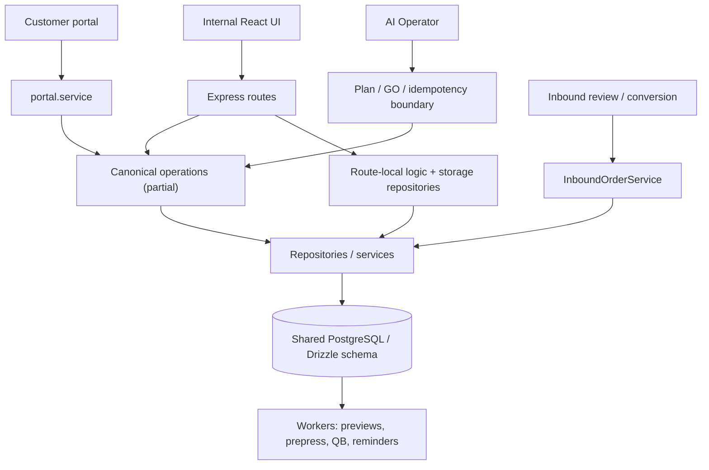
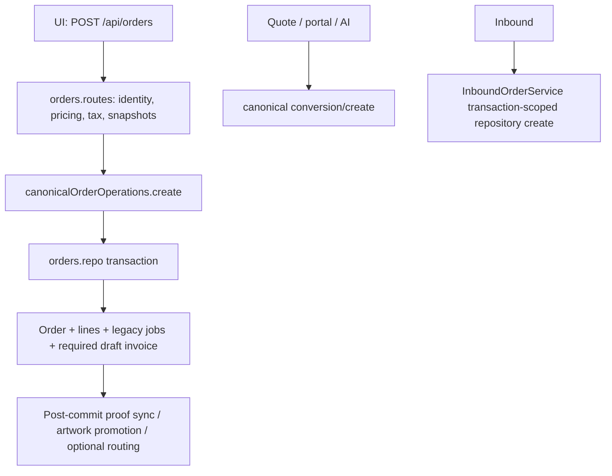

# PrintersHero / TitanOS Current Architecture Audit

**Audit basis:** static inspection of the live DEV checkout at `9236cd21` (2026-08-13). This is a documentation-only audit: no application code, schema, data, migrations, or tests were changed. References below are repository paths and line ranges at that revision.

## Executive summary

PrintersHero is a **single-deployment, database-backed monolith that is in transition toward a modular monolith**. It has useful emerging boundaries (canonical order, quote, invoice, product, artwork, production, fulfillment, and AI operations), but they do not yet consistently own every caller. The operational center of gravity remains large Express routes, repositories, and a few very large services.

Tight coupling is a major source of regressions, but not the only one. The immediate reliability problem is that important workflows have **multiple mutation paths with different authorization, transaction, and side-effect behavior**. Some recently introduced canonical operations reduce this risk; routes and legacy compatibility paths still bypass them.

The five highest-risk findings are:

1. **ARCH-001 (P0):** three ordinary order-cancellation paths bypass the atomic cancellation workflow, leaving invoices, production, proof, fulfillment, inventory, or payments inconsistent.
2. **ARCH-002 (P0):** inbound orders hard-code zero tax; later order-line edits retain stale tax and synchronize the wrong amount to draft invoices.
3. **ARCH-003 (P0):** catalog/PBV2 authorization has organization-scope gaps, including a PBV2 draft save that can auto-activate without a role guard and legacy option/variant operations without tenant ownership verification.
4. **ARCH-004 (P0):** shipment/pickup terminal state is committed before billing automation; a failure leaves an already-shipped/picked-up order without a recoverable invoice trigger.
5. **ARCH-005 (P0):** a shipping-email route is both tenant-unscoped and calls its service with shifted arguments.

These problems do **not** require a rewrite or microservices. The recommended response is nine progressive hardening phases: close P0 boundaries; add behavioral cross-entry-point contracts; then route callers through small canonical application operations one domain slice at a time. Leave the shared PBV2 evaluator, existing transactional quote conversion, inbound claim/linking, and the AI plan/GO/idempotency architecture in place while hardening callers.

It is reasonable to continue feature work only with precautions. Pause expansion that adds new storefront/inbound order creation, external shipping, autonomous AI writes, or new payment/financial mutations until the highlighted boundaries are fixed. Other isolated UI/read/reporting work can continue.

## Scope and codebase classification

The raw checkout is not a measure of live complexity. This audit counted approximately 280k TypeScript/JavaScript/SQL lines under `server`, 217k under `client/src`, and 44k under `shared`; these figures include all source-like files and are directional. `dist` alone contains about 187k built lines and is not independent application logic. The checkout also includes 354 server tests, 15 client tests, 19 E2E specs, legacy migrations, generated build output, reference applications, scripts, screenshots, logs, and extensive implementation notes.

Active runtime entry points are `server/index.ts` and `server/routes.ts`, React `client/src/main.tsx`/`App.tsx`, `shared/schema.ts`, the Drizzle migration stream in `server/db/migrations_v2`, and in-process workers started from `server/index.ts`. `migrations__legacy_ignored`, `reference`, `dist`, root-level migration helpers, historic reports, artifacts, and test fixtures were treated as contextual evidence, not live domain ownership.

## Current architecture and dependency diagram

The route registrar is now only 446 lines, but it registers many independently evolved route modules. High-risk modules are not problematic because of their size alone: they contain state transitions, direct persistence, cross-domain writes, and side effects. Examples: `server/routes/orders.routes.ts` (8,565 lines, 77 mutation endpoints), `server/routes/inboundOrders.routes.ts` (43), `server/routes/mvpInvoicing.routes.ts` (23), `server/routes/productionJobs.routes.ts` (21), `server/routes/fulfillment.routes.ts` (19), `server/services/inboundOrders/InboundOrderService.ts` (6,024), `server/services/pricing/PricingService.ts` (5,042), and `server/services/portal.service.ts` (4,067).

### Domain dependency matrix

| Domain | Current owner / tables | Reads from | Writes / calls | Called by | Coupling / risk |
| --- | --- | --- | --- | --- | --- |
| Customers / contacts | `customers.routes.ts`, `customerRelations.routes.ts`, partial `customers/canonicalCustomerContactOperations.ts`; `customers`, contacts, links, credit tables | Orders, quotes, invoices | Customer/contact rows; merge rewrites many domains | UI, imports, inbound, portal | High / P1 |
| Products / PBV2 / pricing | `PricingService.priceLineItem`; partial product canonical operations; product routes + legacy shared repo | Products, PBV2 versions, formulas, materials | Product config, PBV2 versions, snapshots | UI, quote/order/inbound/AI | Critical / P0-P1 |
| Quotes | `canonicalQuoteOperations` for headers; quote route/repo for substantive workflow | Customers, products, pricing, tax, artwork | Quotes, lines, workflow, conversion | UI, portal, AI, inbound draft | High / P1 |
| Orders / lines | Thin `canonicalOrderOperations`; `orders.routes.ts` + `orders.repo.ts` are effective owner | Customers, products, pricing, proof, workflow | Orders, lines, jobs, invoice draft, artwork/routing | UI, quote conversion, portal, AI, inbound | Critical / P0-P1 |
| Artwork / proof | canonical read/write subset; file/proof routes and services | Files, orders/lines, prepress | Artwork relations, projections, proof state | UI, inbound, portal, prepress, production | Critical / P0-P1 |
| Production / prepress / runs | line workflow, production run service; much route-owned lifecycle | Orders/lines, proof, artwork, materials | Jobs/runs/events, inventory, order readiness | UI, AI, order workflow | Critical / P0-P1 |
| Fulfillment / shipping | V2 canonical facade/service/repository plus legacy helper/routes | Orders, production, artwork | Shipments/pickups/events, orders, billing trigger | UI, AI, production | Critical / P0-P1 |
| Billing / payments / credit | `invoicesService`, partial canonical invoice/payment operations, invoicing route | Orders/lines, customers, payments | Invoices/lines/payments, orders.billingStatus | UI, portal, AI, workers | Critical / P0-P1 |
| Authorization | `tenantContext`; mixed `isAdmin` and route checks; AI authority resolver | Session, memberships | Access decisions | UI/API/AI/portal | Critical / P0-P1 |
| AI Operator | registry, planning/execution services and repos | Tenant authority, domain ops | Plans, confirmations, domain calls | Assistant UI | Medium; safer than routes |
| Portal / storage / workers | `portal.service`, object/file services, `server/index.ts` workers | Customer scope, domain data | Profile/files/proofs/quotes/payments; async effects | Portal, background | High / P0-P1 |

Real domain cycles are intentional but presently ungoverned: Orders ↔ Production (orders schedule; production changes order/line readiness), Orders ↔ Billing (orders create/sync drafts; invoices change `orders.billingStatus`), Orders ↔ Fulfillment (production/order state gates fulfillment; fulfillment updates orders), Artwork ↔ Prepress/Proofing/Production (each consumes and may promote/retire relationships), and Products ↔ Pricing (configuration versions define the evaluator input). These are reliability risks because each direction has more than one owner.

## Domain ownership and mutation maps

### Customers, contacts, credit

The intended customer/contact owner is `server/services/customers/canonicalCustomerContactOperations.ts`; effective ownership is split between `server/routes/customers.routes.ts`, `server/routes/customerRelations.routes.ts`, `server/storage/customers.repo.ts`, import code, inbound conversion, and customer merge services. Canonical customer create/update does not own relationship, link, status, deletion, import, merge, or credit writes.

Customer merge is intentionally transaction-level cross-domain orchestration (`server/services/customerCanonicalIdentityService.ts:165-446`), directly rewiring quote, order, invoice, and inbound references. This is coherent for a same-survivor merge but has no domain callback contract for future denormalized data.

Credit has competing sources: ledger transactions, `customers.currentBalance`, and invoice-derived `customerCreditExposureService`. `CustomersRepository.updateCustomerBalance` uses legacy `type`/`reason` keys while the active schema requires `transactionType`/`description` (`shared/schema.ts:3325-3334`; `server/storage/customers.repo.ts:1123-1132`). The generic credit route creates a ledger entry without updating `currentBalance`; exposure ignores both and derives invoice balances. This is ARCH-010.

### Products, PBV2, and pricing

`server/services/pricing/PricingService.ts#priceLineItem` is the clear canonical PBV2 evaluator. It returns a pricing snapshot used by quote, order, inbound, and AI flows (`PricingService.ts:660,1019`). Do not create another evaluator.

Configuration ownership is fragmented: `products.optionsJson`, `optionTreeJson`, active tree pointers, `pbv2_tree_versions`, legacy `product_options`, and legacy `product_variants` coexist (`shared/schema.ts:745-905,1457,1686`). Product Editor, direct product PATCH, imports/clones, PBV2 compatibility routes, and bounded AI draft persistence are mutation paths. Normal UI/AI canonical operations cover important slices, but direct route persistence remains.

`PUT /api/products/:productId/pbv2/draft` uses authentication and tenant context but no role guard (`products.routes.ts:872`) and can auto-activate a tree/pointer in auto-on-save mode (`993-1091`). Legacy option/variant routes are unscoped by tenant and use global admin (`2331-2435`; `storage/shared.repo.ts:615-693`). Both are P0 access-control risks.

### Quotes

Quote header create/update is wrapped by `canonicalQuoteOperations` (`server/services/quotes/canonicalQuoteOperations.ts:16-45`), but quote creation, tax/pricing preparation, workflow, duplication/revision, and line mutation remain route/repo-owned (`server/routes/quotes.routes.ts:739-995,1444-2956`; `storage/quotes.repo.ts:588-899`). Creation route validates identity, calculates tax, resolves proof requirements, builds snapshots, invokes the wrapper, then independently best-effort writes list notes.

This is a partial boundary, not a single canonical quote mutation API. Quote conversion is better: `orders.repo.ts` locks the quote, maps lines/snapshots, writes conversion links/artwork/audits inside a transaction and returns an existing conversion idempotently (`1783-2327`). It is used by multiple HTTP routes, portal approval, and AI.

### Orders and order lines

`canonicalOrderOperations` wraps direct create, editable header update, and conversion (`server/services/orders/canonicalOrderOperations.ts:17-50`). Its substantive persistence is `storage.createOrder/updateOrder/convertQuoteToOrder`; effective behavioral ownership is split across `orders.routes.ts` and `storage/orders.repo.ts`.

Current direct-create flow is:

Direct UI creation atomically persists order, lines, legacy jobs, and required draft invoice (`orders.repo.ts:1293-1674`). Proof synchronization, pending-artwork promotion, and optional routing happen after commit and fail soft (`orders.routes.ts:2456-2510`), so a successful commercial order can need recovery. Direct idempotency is a process-local two-minute map (`orderCreationIdempotency.helpers.ts:1-55`), unlike durable quote conversion and inbound claims.

Other creation paths are quote conversion (`orders.routes.ts:5678,5741,5979`), portal approval (`portal.service.ts:4268-4299`), AI intake (`assistant/orderIntakeService.ts:383,408`), and inbound conversion (`InboundOrderService.ts:3890-4043`). Inbound performs order, invoice, artwork, linkage, and audit in a transaction but calls transaction-scoped repository create rather than the facade; it also hard-codes zero tax (ARCH-002).

Status is a material duplication: `orders.status`, `state`, `canonicalState`, `workflowStatusId`, and status pill all mutate independently. The normal cancellation service is the only comprehensive cleanup transaction, yet `/transition`, `/state`, and workflow-status routes permit cancellation-like writes outside it. See ARCH-001.

### Artwork and proofing

The intended canonical artwork source is `line_item_artwork`, with `CanonicalArtworkWriteService`, `LineItemArtworkService`, and `LineItemArtworkReadResolver` (`server/services/artwork/*`). Compatibility projections remain in `order_attachments`, `line_item_files`, and assets. Attach/promote/modified/supersede are canonicalized, while side assignment, allocation, and deletion remain route-owned (`orderLineItemFiles.routes.ts:880-1166,1181-1320`). The delete route does not retire `line_item_artwork`, while the resolver intentionally reads only it; deleted artwork can remain current for proofing/production/fulfillment (ARCH-006).

Proofing's state machine is `proofingService.ts`; `canonicalProofingOperations` shares send/response, including the portal response path. Routes still orchestrate generation, token, audit, and email. Proof state commits before fire-and-forget email; a success can block a line awaiting a never-delivered proof without durable delivery state (ARCH-014).

### Production, prepress, and combined runs

`lineItemWorkflowService`, `productionOwnership`, `productionRunService`, and selected canonical production/prepress operations are the strongest owners. Job completion, reopen, assignment, and many prepress operations still live in routes. `CanonicalProductionOperations` explicitly covers intake/start/note/return but not completion/reopen/assignment.

Standalone completion routes jobs, line items, materials, successor fulfillment work, order readiness, and audit in a transaction; a workflow-pill side effect is post-commit/fail-soft. Combined-run completion duplicates order-readiness behavior. Ordinary return-to-prepress is implemented both canonically and inline; combined run recovery is a third path. `/jobs/:jobId/reopen` only reopens the job and leaves successor fulfillment/line/order state untouched (ARCH-007). Order-level `complete-production` can mark incomplete lines completed without the equivalent job/run material/timer/outcome semantics (ARCH-013).

Prepress completion calls a service that uses global `db` inside an apparent route transaction (`prepress.routes.ts:2826-3037`; `prepressFileService.ts:1886-1983`); final artwork or timeline can commit independently (ARCH-015).

### Fulfillment and shipping

V2 fulfillment is `canonicalFulfillmentOperations` → service → repository, used by the V2 UI and supported AI commands. Legacy `fulfillmentService.ts`, a duplicated fulfillment-status route, and blocked legacy UI routes remain. Shipping/pickup repository transactions correctly lock and record terminal state, event, and order synchronization. Billing automation runs only after that transaction (`services/fulfillment/repository.ts:438-556,757-909`; `service.ts:390-430,530-557,652-667`); a billing failure makes the retry invalid because the shipment is no longer draft (ARCH-004).

`POST /api/orders/:orderId/send-shipping-email` has only `isAuthenticated`, no tenant context (`fulfillment.routes.ts:521`), and calls a five-argument service as though it had four (`521-530`; `fulfillmentService.ts:111-208`). Its query methods are unscoped. This is ARCH-005.

### Billing, invoices, payments, and exposure

`invoicesService.ts` owns financial snapshot/rollup math; `canonicalInvoiceOperations` adds selected reviewed operations, including advisory-lock protected draft creation/finalization (`server/services/billing/canonicalInvoiceOperations.ts:10-53`). `mvpInvoicing.routes.ts` still contains broad financial mutations and some direct writes.

The canonical manual payment recording transaction is strong. Stripe confirmation, manual void/delete, and webhook paths update payment then refresh invoice in a separate commit; a failed refresh leaves stale invoice balance/status and retry can skip recovery (ARCH-009). `PATCH /api/invoices/:id` independently updates header totals outside the canonical safe draft service without synchronizing immutable invoice lines (ARCH-011). Many sensitive invoice/payment routes are only authenticated + tenant-scoped, while another provider path has an explicit permission check; this is inconsistent authority (ARCH-012).

## Cross-domain writes, events, and transaction assessment

| Writer | Mutates | Current mechanism | Reliability assessment |
| --- | --- | --- | --- |
| Order create/conversion | Lines, jobs, invoices, artwork/audit | repository transaction, then post-commit helpers | Good core atomicity; P1 recovery gap |
| Cancellation | orders/lines/jobs/proofs/invoices/fulfillment/inventory | `orderCancellationService` transaction | Good canonical operation, bypassed by P0 routes |
| Production completion | line/job/run/material/order/fulfillment successor | route/run service transactions | Duplicated workflows and reopen bypass |
| Fulfillment terminal | shipment/pickup/order then billing | transaction plus post-commit billing | P0 missing-invoice/retry gap |
| Invoice finalization | invoice + order billing status | canonical transaction; post-commit status pill | Core protected; secondary effect fail-soft |
| Payment actions | payment + invoice rollup | mixed transactions/separate commits | P0 for reversal/Stripe gaps |
| Artwork mutation | canonical + compatibility tables | mixed service/route transactions | P0 deletion bypass |
| Customer merge | many foreign keys | one direct cross-domain transaction | Intentional but contract-less |

There is no application-wide event bus. Important effects are currently service orchestration, route-specific calls, generic audit logs, domain event tables (`production_events`, `fulfillment_events`), hidden helpers, or workers. The highest-value future internal events are durable/retryable records for `OrderInitializationRequired`, `FulfillmentTerminalStateReached`, `ProofDeliveryRequested`, and `InvoiceRollupRequired`. This is an internal modular-monolith mechanism, not a recommendation for Kafka or distributed services.

## Authorization and frontend authority

`tenantContext` is broadly applied and the portal has a useful explicit internal-API denial boundary. However, global `users.isAdmin` is still used for ordinary organization catalog/pricing decisions even though `server/routes.ts:125-154` describes organization membership as authoritative. This creates different authority rules in UI/API/AI.

AI is the best-contained mutation surface: a static 39-command registry; tenant/actor-scoped plan persistence; one-time actor/tenant-bound confirmation; authorization/revalidation at GO; and idempotency (`assistant/execution/commandRegistry.ts:29-72`, `actorAuthorityResolver.ts:42-50`, `canonicalCapabilityRegistry.ts:218-229`, `assistantExecution.repo.ts:58-154`, `executionPlanningService.ts:132-195`). It generally calls canonical Product, Order, Quote, Invoice, Production, and Fulfillment subsets. It is not complete parity: AI intentionally excludes advanced override/delete/most administration and has bounded draft-only compatibility paths. The key issue is that some UI/API paths are less strict than AI, not that AI is an uncontrolled alternate backend.

Frontend code is mostly presentation, cache management, and user-experience validation. It does contain non-authoritative local totals: `DocumentCreateForm.tsx:158-386` recomputes option costs, subtotal, and a default 8% tax before sending values, even though the server quote route recomputes tax/pricing. This is a P1 divergence risk if any accepting route trusts values. It also contains repeated role display gates (`lib/nav.ts`, `titanNavigation.ts`, quote/production pages); these are navigation controls, not server authority. Unsafe backend actions are exposed by the production reopen and complete-production UI, and legacy shipment UI invokes routes intentionally blocked by the backend.

## Test architecture and regression hotspots

The suite has substantial focused coverage: 354 server tests, 15 client tests, 19 Playwright E2E specs. Strong behavioral coverage exists for quote conversion concurrency/rollback, normal proof flow, production lifecycle, fulfillment ship/pickup, and prepress handoff. Pricing has focused golden/snapshot tests. AI has registry, authority, GO, revalidation, and idempotency tests.

Coverage quality is uneven. Several so-called contract tests are source-string assertions rather than behavioral/failure-injection contracts. Critical missing tests include: every cancellation-like entry point uses canonical cancellation; taxable inbound order/invoice totals; tax recompute after line edits; payment/invoice recovery after an injected failure; invoice header-line integrity; cross-tenant legacy catalog access; PBV2 draft authority and auto-save/publish equivalence; shipping email tenant/signature; artwork deletion removes canonical readability; shipment/pickup billing recovery; reopen unwinds fulfillment/order/line state; and UI/AI/API canonical-operation parity.

Git history corroborates hotspots without being the sole evidence: recent DEV commits include fixes for fulfillment workspace, invoice lifecycle, order/product AI parity, canonical artwork, quote conversion atomicity, and product/PBV2 canonical migration. Repeated repair commits align with the multiple-owner seams above.

## Findings summary

The stable finding register is in [ARCHITECTURE_FINDINGS.md](ARCHITECTURE_FINDINGS.md). P0 findings are active data-integrity, authorization, tenant-isolation, financial, or production/fulfillment hazards; P1 findings are high regression coupling; P2/P3 are staged debt. Severity is evidence-based and intentionally not inflated.
