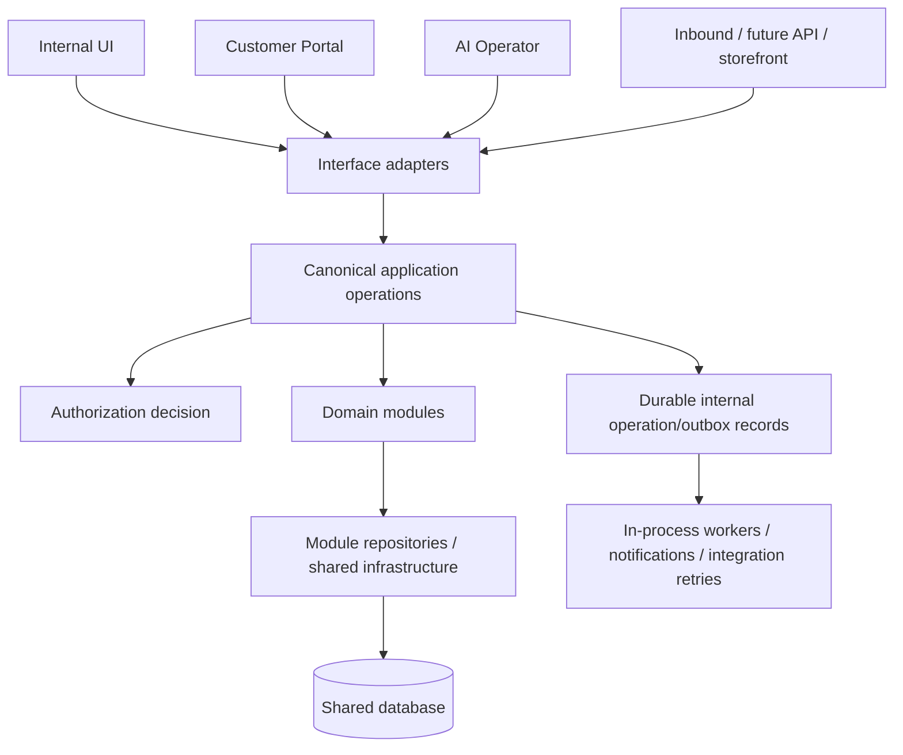
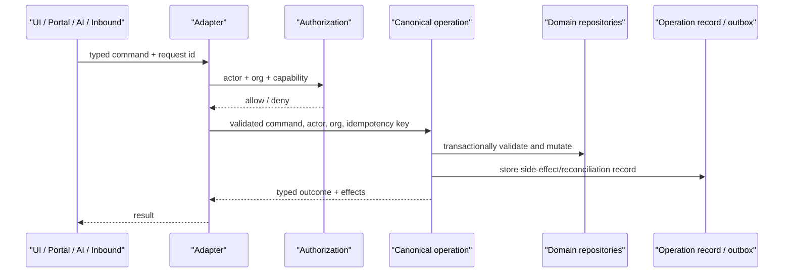

# Target Modular Architecture

## Direction

The appropriate target is a **modular monolith**: one repository, deployable application, shared PostgreSQL database, shared authentication, and in-process workers. It is not a microservices case. The present failures are ownership and transaction failures inside one application; network boundaries, separate databases, Kafka, or service-per-domain deployment would add failure modes without curing them.

## Proposed boundaries

| Module | Owns | May depend on |
| --- | --- | --- |
| Authorization | actor, active organization, capability decision | shared identity infrastructure only |
| Customers | customers, contacts, identity/merge, credit policy | authorization; published order/invoice read models |
| Catalog | products, product lifecycle, PBV2 configuration, legacy compatibility | authorization |
| Pricing | PBV2 evaluator and price snapshot contract | Catalog read contract, tax policy |
| Quotes | quote, quote lines, quote workflow/conversion proposal | Customers, Pricing, Artwork policy |
| Orders | orders, lines, order lifecycle and initialization state | Customers, Pricing, Quote conversion contract |
| Artwork & Proofing | file relationships, artwork lifecycle, proof workflow | Orders/lines read contract, storage infrastructure |
| Production | line workflow ownership, jobs, prepress, runs, material effects | Orders, Artwork/Proofing, inventory infrastructure |
| Fulfillment | shipment, pickup, checklist, terminal fulfillment lifecycle | Orders/Production read contract, notifications, Billing request |
| Billing & Payments | invoices, immutable invoice snapshots, payments, exposure | Orders snapshot contract, Customers read contract |
| Interfaces | internal UI, portal, inbound, AI, future API | canonical application operations only |

No module should import another module's repository/table for mutation. Read-only queries may use curated module query services; cross-domain writes occur through an application operation that names its consistency boundary.

## Canonical mutation model

Every material business mutation should have one named application operation independent of caller. Interfaces authenticate, derive tenant/actor context, parse DTOs, call the operation, and serialize results. They must not reproduce domain state decisions.

Initial operations should include `createOrder`, `convertQuoteToOrder`, `updateOrderLinesAndTotals`, `cancelOrder`, `completeProduction`, `recoverProductionCompletion`, `attachArtwork`, `retireArtwork`, `recordProofResponse`, `shipShipment`, `markPickupReady`, `markPickedUp`, `createDraftInvoice`, `finalizeInvoice`, and `recordOrReversePayment`. Existing canonical operations are starting points, not a mandate to rewrite all domain logic.

## Dependency and persistence rules

1. A module owns its write tables. Compatibility projections may be written only by its operation and documented as projections.
2. An operation that changes multiple modules declares whether it is atomic or asynchronous. Atomic operations use one transaction; asynchronous work is a durable, idempotent record with reconciliation, not a fire-and-forget call.
3. Retries use durable idempotency keys at externally retried entry points (order creation, provider callback, terminal fulfillment, AI GO).
4. Status transitions are module-owned state machines. Do not permit generic PATCH/transition routes to represent terminal business actions such as cancellation.
5. Generic audit logs supplement—not replace—domain lifecycle records. Audit/event persistence follows the mutation transaction or outbox contract.
6. Pricing is evaluated once by `PricingService` (or a later extracted equivalent); callers persist its immutable snapshot and never recalculate authoritative totals.

## Authorization principles

Authorization is a server-side module with an organization-scoped capability vocabulary. `user_organizations.role` and explicit platform roles are inputs; global `isAdmin` is not a substitute for active-org authority. Every mutation operation accepts a resolved actor/organization context and performs/receives its capability check. UI visibility is advisory. Portal roles are separate customer capabilities. AI has no elevated identity; its existing admin ceiling, GO, revalidation, actor binding, and idempotency become the model for other interfaces.

## Frontend, AI, API, and portal responsibilities

Frontend owns interaction state, optimistic display, formatting, navigation, and UX validation. It may calculate previews, but must render server-returned pricing/tax/workflow authority and not choose final transitions. UI, portal, inbound, and future storefront/API adapters send typed commands to the same operations.

AI remains an interface adapter: static capabilities, server-owned plan, explicit GO, actor/org binding, current-state revalidation, idempotency, and audit. Its supported command should call the exact operation used by the UI. AI-ineligible operations remain deliberately excluded until they achieve the same command contract.

## Testing strategy

Use behavioral contract tests around operations, not source-string assertions. For every canonical mutation, test authorization matrix, tenant isolation, valid/invalid transition, rollback/failure injection, idempotent retry, side-effect/reconciliation record, and parity across UI/portal/AI/inbound callers where applicable. Retain focused unit tests for pricing and pure policy. Use integration tests for database transactions and a limited E2E path per customer-facing workflow.
