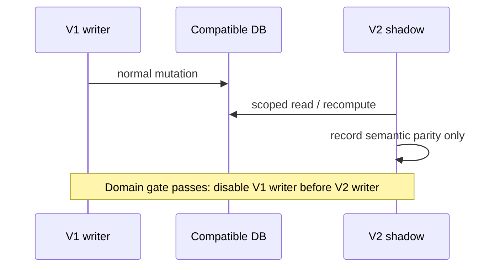
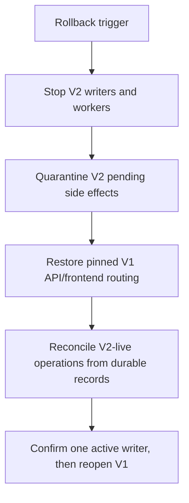

# V2 Coexistence, Cutover, and Rollback Plan

## Data and deployment posture

Deploy V2 as a separately deployable Railway service/API and Vercel DEV/preview frontend or alternate V2 domain, while V1 remains pinned and independently deployable. Current Vercel `/api` and `/objects` rewrites make an isolated endpoint practical. Do not mix V2 business operations into the V1 backend behind opaque feature flags.

Use the current PostgreSQL database with additive backward-compatible V2 migrations. Preserve existing IDs and live records. Open customers, contacts, products/PBV2, org settings, users/memberships, quotes, orders, invoices, payments, artwork, production, and fulfillment state require exact preservation. Completed/archived history begins as compatibility reads or read-only legacy projections. Caches, generated previews, and dead transitional projections are candidates for later regeneration only after consumer inventory.

## Transition rules

1. V1 remains the sole writer of the existing V1 DEV and production business databases until a production domain gate passes. V2 writes normally to its dedicated isolated V2 DEV database and authorized disposable clones.
2. In a shared production database, a cut-over domain has exactly one writer: V2. Disable corresponding V1 routes and workers before V2 production writes. V2 DEV transactions are never merged into production.
3. Never independently dual-write shared business objects. Provider ingress is recorded once and reconciled by the active owner.
4. Shadow mode is read-only: pricing, permission decisions, quote eligibility/snapshots, fulfillment availability, exposure, and reconciliation projections.
5. Use disposable clones for write parity, with explicit operator-approved target/write opt-in/no fallback. A neutral clone database name is acceptable when provenance is explicitly verified.

## Cutover runbook

### Readiness gate

- V2 operation, repository, integration, and interface contracts pass.
- Disposable current-DEV clone parity and migration postconditions pass.
- DEV live validation covers order → proof → production → partial fulfillment → invoice/payment and Portal flow.
- Authorized read-only PROD schema audit matches required physical contracts.
- Worker inventory/ownership, provider event handling, queued job disposition, observability dashboard, support runbook, backup/snapshot, and rollback rehearsal are approved.

### Controlled maintenance window

1. Announce and freeze V1 mutations; drain or identify each in-flight job.
2. Stop V1 domain workers. Maintain one controlled provider ingress/inbox without applying duplicate business effects.
3. Take verified backup/snapshot; re-run schema and queue preflight.
4. Apply only additive V2 migrations and verify catalog postconditions.
5. Deploy already-tested V2 backend/frontend; transfer workers one by one.
6. Reconcile pending proof delivery, provider receipt, fulfillment/billing, QuickBooks, storage, and Bridge records.
7. Switch frontend/API routing and validate sessions, tenant scope, a Staff workflow, Portal workflow, and provider ingress.
8. Run intensified reconciliation and daily operation-level review during the rollback window.

## Rollback

Trigger rollback on tenant/auth breach, unexplained P0/P1 parity drift, unrecoverable idempotency/outbox backlog, provider mismatch, broken workflow invariant, or unsafe worker duplication.

Do not roll back additive schema. Preserve V2 operation IDs, attribution, provider events, and outbox records. V1 reads existing compatible core records; V2-only incomplete work is manually or controlled-replay reconciled before V1 writes resume. Never restart both worker generations. Every mutation during V2 live time is reconciled from durable request/attribution/outbox state.

## V1 retirement

V1 is removable only after all production routes, workers, integrations, and hidden consumers have V2 ownership; historical read compatibility is proven; shadow/parity drift is accepted; operational dashboards are stable; the observation/rollback window expires; and no V1-only traffic remains. “V2 works in DEV” is not a retirement criterion.
