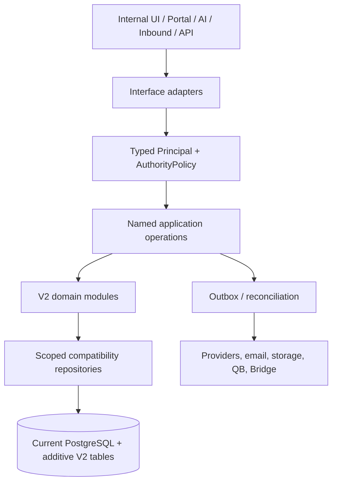
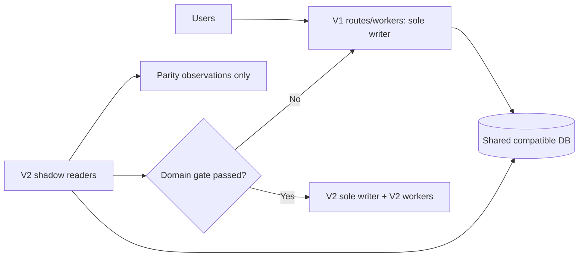

# PrintersHero V2 Reconstruction Master Plan

## Executive recommendation

**PROCEED WITH V2 RECONSTRUCTION.** Build a production modular monolith beside V1, in this repository, using the current PostgreSQL schema plus narrow additive V2 persistence. Do not promote `v2-poc/` as production code and do not replace the database wholesale.

1. **Proceed?** Yes. The POC proved the commercial spine, quote conversion, artwork/proof/prepress, fulfillment, finance, principal authority, and PostgreSQL concurrency against a DEV-shaped clone (75/75 V2 tests).
2. **Why not continue V1 modularization?** V1 has valuable semantics but multiple route/service mutation paths. The audit identifies duplicate authority, transaction, pricing, tax, and side-effect ownership; continuing in place would preserve that shape while trying to untangle live code.
3. **What survives?** PBV2’s pure evaluator, business contracts/tests, React shell and display components, transactional quote-conversion semantics, AI Plan/GO concepts, inbound parsing/review, storage foundations, Local Bridge trust model, and integration credentials/UI shells.
4. **What is rewritten?** Route-local and service-local business mutation orchestration. V2 owns named application operations, typed authority, repositories, idempotency, and durable side effects.
5. **Database?** Reuse the current database and core tables; add production-designed operation-request, attribution, outbox/reconciliation, and narrowly justified invariant tables/indexes.
6. **Repository?** Same repository, new top-level production V2 modules/application. Keep V1 and V2 independently deployable; do not use the POC branch as the production branch.
7. **Build shape?** Parallel V2 service with a vertical-slice strangler cutover. V1 is the sole writer until each V2 domain is approved, then V2 is the sole writer for that domain.
8. **Sequence?** Foundation → commercial spine → artwork/production → fulfillment/finance → interface/integration adapters → shadow/parity → controlled cutover.
9. **Calendar estimate.** Optimistic 3–4 months; likely 6–9 months; conservative 9–14 months, including human workflow validation and cutover rehearsal.
10. **Model/cost estimate.** Tens of millions of model tokens across the program is a planning estimate, not a quote. Use Tera for invariants/schema/finance/production, lower-cost models for inventories and mechanical work, Sol only for demonstrated architecture/concurrency stalls. Translate tokens to dollars only using current provider pricing at approval time.
11. **Cutover.** A short controlled maintenance window after clone parity, DEV validation, PROD read-only audit, and rollback rehearsal—not an assumed zero-downtime switch.
12. **Rollback.** Stop V2 writers/workers, restore V1 routing, retain additive schema, quarantine V2-only pending side effects, reconcile durable records, then reopen exactly one writer.
13. **Second tenant.** Do not onboard another external tenant before V2 cutover.
14. **V1 during build.** Fix security, integrity, and customer-blocking defects; capture every material behavior change as a V1 test/parity-contract/V2-backlog update.
15. **Largest risks.** Missing legacy behavior/drift; provider and worker recovery; schema compatibility/physical drift; artwork/storage state; unsafe cutover or hidden consumers.

The POC establishes architecture viability, not release readiness. Authentication issuance, API keys, workers/leases/backoff, real provider adapters, storage delivery, migration rehearsal, and operational runbooks must be built and proven.

## Evidence and decisions

This plan is based on the architecture audit, remediation roadmap, DEV physical-schema audit, all V2 evaluation documents, the POC history from `d3aa9363` through `c1a20fe9`, and read-only inspection of `origin/dev` (`a3a75cd1`) and `origin/main` (`7279f8a0`). DEV is one fulfillment-focused commit ahead of MAIN. The POC must be recreated from the then-current DEV schema, not merged into DEV.

The recommended shape is a **hybrid of Strategy B (parallel V2 application) and Strategy C (domain cutover/strangler)**. Strategy A leaves V1's high-risk ownership topology in place. Strategy D adds an unnecessary data/API migration boundary and prevents direct reuse of contracts, UI, tests, and compatibility repositories.

## Production module architecture and rules

| Module | Owns / canonical operations | Reads / may call | Must not directly mutate |
| --- | --- | --- | --- |
| Authorization | principals, capabilities, resource policy, attribution | membership adapter | domain data or interface sessions |
| Customers | customer/contact identity, portal account scope | org, credit projection | orders/invoices except named merge operation |
| Catalog/Pricing | product version lookup, PBV2 evaluator adapter, price snapshot | catalog configuration | quote/order totals after snapshot |
| Quotes | quote lifecycle, locked snapshot, convert quote | customers, pricing, artwork | order persistence except `ConvertQuote` operation |
| Orders | direct create, initialization, lifecycle/cancellation | customers, pricing, quote, artwork | invoice/payment/provider records except named operation orchestration |
| Artwork/Proof | file identity, allocation, revision, proof response/delivery state | orders/lines, storage | production/fulfillment quantities |
| Prepress/Production | handoff, run outcomes, readiness | artwork/proof, order lines | financial rollups |
| Fulfillment | canonical availability, pickup, shipment, terminal event | production outcomes, order lines | invoice math; emits reconciliation work |
| Billing/Payments | invoice-line math, corrections, payment/refund/provider reconciliation | orders, customers, fulfillment terminal event | fulfillment state |
| Integrations | provider adapters, outbox consumers, worker leases | named operations only | business tables directly |
| Interfaces | HTTP/React/Portal/AI/Inbound/API translation | application operation ports | repositories, SQL, pricing, tax, lifecycle rules |
| Audit/Reconciliation | operation requests, attribution, outbox, parity observations | immutable domain results | business decisions |

Enforce with lint/import boundary tests: adapters cannot import repositories/DB/V1 services; domains cannot write another domain’s tables; cross-domain mutations use named operations; all repository methods require organization/resource scope; only the pricing module evaluates price; only billing calculates invoice rollups; only fulfillment calculates availability; and all business mutations have operation-specific durable idempotency.

## Reuse, rewrite, and POC production-worthiness

The detailed matrix is in [V2_REUSE_REWRITE_INVENTORY.md](V2_REUSE_REWRITE_INVENTORY.md). The key rule is: retain V1 semantics and tests, but rebuild ownership. `v2-poc/` is a contract/reference suite, not an application to lift unchanged. Promote/refine only small pure policy ideas after production review; rebuild persistence and application code with production authentication, migrations, observability, and workers.

## Database and data strategy

Adopt **current schema + additive V2 tables + progressive normalization**. Existing organization, membership, customers/contacts, products/PBV2 pointers, quotes/orders/invoices/payment snapshots, file/artwork relations, production/fulfillment state, and provider uniqueness are valuable compatibility assets.

Before V2 writes, add production-designed equivalents of principal attribution, principal-neutral business operation requests, durable outbox/reconciliation, and operation-specific integrity indexes. Do not copy POC inline DDL or relax legacy `created_by_user_id` constraints blindly. Production has one append-only migration source in `server/db/migrations_v2`; no application-startup DDL.

Compatibility repositories isolate duplicate decimal/cents financial fields, PBV2/legacy product representations, artwork projections, overlapping status fields, and legacy ownership. Normalize only an invariant that blocks the next canonical writer; defer broad product/status/financial cleanup until V2 owns that domain. Preserve exact live customer/catalog/PBV2/user/org/open-workflow data. Initially expose completed historical records through compatibility reads/read-only legacy projections rather than bulk-transforming young history.

Every high-risk migration requires immutable append-only SQL, journal-order preflight, schema contract manifest, disposable DEV-shaped clone rehearsal, and physical catalog postconditions. A migration ledger is never sufficient evidence. Before MAIN promotion, perform the same checks with an authorized read-only PROD connection.

## Interfaces, frontend, and integrations

Reuse the React shell, route layout, visual components, and good list/detail pages. Replace form submission, state transition, and client-side price/tax authority route-by-route. Keep the current Portal UI where it is customer-safe, but replace calls with Portal-principal adapters and filtered response DTOs; do not expose internal notes/status/QuickBooks fields. Do not build a new frontend shell merely for architectural purity.

- **AI:** retain static capability registry and Plan/GO with actor/org binding/revalidation. AI only invokes V2 operations; it owns no mutation logic.
- **Inbound:** retain ingestion, parsing, evidence, review, and candidate construction. Its final quote/order/artwork actions invoke V2 operations; no hard-coded tax or alternate persistence.
- **Storefront/API:** establish Service Principal → adapter → operation contracts, versioned DTOs, idempotency keys, per-client capability scopes, and opaque resource IDs. Do not expose tables or build the storefront now.
- **Storage/email/QB/Stripe/Local Bridge:** adapt existing foundations behind integration ports. Use durable outbox/reconciliation before enabling real side effects. Retain Local Bridge's outbound-only least-privilege model. Defer carriers, Onyx/hot folders, Illustrator/nesting, and MCP mutation scope until core contracts are stable.

## Delivery sequence and milestones

Use a **hybrid vertical-slice approach**: establish cross-cutting foundation once, then complete commercial-to-operational vertical slices. A module is not “done” merely because its folder exists.

| Milestone | Scope and prerequisites | Exit criteria / V1 authority |
| --- | --- | --- |
| M0 Foundation | V2 app shell, ports, Principal/Authority, repository conventions, production migration/outbox/request designs, observability | boundary tests, clone safety, physical checks; V1 sole writer |
| M1 Commercial spine | customers/contacts, catalog/PBV2 adapter, pricing, direct order, quote lifecycle/conversion | semantic parity, PG rollback/concurrency, DEV read-only shadow; V1 writer |
| M2 Artwork to production | artwork/proof, prepress, production outcomes/readiness | lineage/proof/quantity contracts and storage/outbox rehearsal; V1 writer |
| M3 Fulfillment and finance | pickup/shipping, billing, payment/refund/provider recovery | availability/invoice/provider contracts; V1 writer |
| M4 Interface convergence | staff UI adapters, Portal, AI, Inbound final submission, Service API DTOs | all supported callers use one operation; V1 writer |
| M5 Shadow/parity | compare V1 and V2 calculations/eligibility on live reads; clone write parity | accepted drift register, no unexplained P0/P1 mismatch |
| M6 Domain cutovers | one domain at a time, V2 routes/workers become sole writer | routing disabled in V1, rollback rehearsal per domain |
| M7 Cutover readiness | full workflow, integration, schema, operational gates | DEV live validation + PROD read-only audit + maintenance runbook |
| M8 Production cutover | controlled switch and heightened reconciliation | V2 sole writer, V1 pinned fallback |
| M9 Retirement | remove V1 only after observation window | no V1 routes/workers/consumers and historical reads proven |

Each milestone receives coherent reviewable commits: contract/schema design, operation/repository implementation, tests, then adapter/deployment wiring. Do not make one giant V2 commit or hundreds of mechanical micro-commits.

## Parity, testing, and observability

Build a semantic parity harness that normalizes generated IDs/timestamps and classifies each result as **required parity**, **intentional V2 correction**, **V1 legacy behavior not carried**, or **human decision**. Seed disposable DEV-shaped clones with two organizations, principals, PBV2 variations, tax/terms, open/historical commercial records, artwork/proofs, partial production/fulfillment, payments/refunds, and provider events.

Testing pyramid: pure policy/pricing/money tests; application contracts; PostgreSQL transaction/failure/concurrency/tenant tests; interface parity tests; limited DEV E2E for the full order-to-payment and Portal flows. Reuse V1 tests as characterization assets, transforming route-specific tests into operation contracts or parity tests. Shadow only read/calculation decisions—pricing, permission eligibility, quote eligibility/snapshot, availability, exposure, reconciliation projection. Never shadow-write shared production data.

Minimum operational signals: operation/business request IDs; principal kind/subject/verified Staff actor; org/resource IDs; reconciliation attempts/errors; provider event identity; worker lease/dead-letter state; physical-schema result; and parity drift. Dashboard pending/failed proof delivery, fulfillment-to-billing reconciliation, provider receipts, QB work, parity mismatches, request conflicts, and worker ownership.

## V1/V2 coexistence, V1 policy, and tenant timing

There is one authoritative writer per domain. Avoid dual writes. If a temporary comparison copy is unavoidable, it must be durable, idempotent, reconciled, time-limited, and explicitly retired. Continue V1 work only for urgent security/integrity/customer-blocking fixes; for any material business change, write a requirement note, update a V1 behavior test/parity contract, and update the V2 backlog. Prefer large new platform work in V2; defer nonessential expansion. Cut over before a second tenant, storefront launch, broad AI mutation, or carrier automation increases the migration surface.

## Risks and decision gates

| Priority | Risk | Control |
| --- | --- | --- |
| P0 | missed V1 behavior / drift | change capture, contracts, clone parity, human workflow validation |
| P0 | provider/worker side effects | outbox, reconciliation, leases, receipts, dead-letter dashboard |
| P0 | schema compatibility/physical drift | immutable migrations, clone rehearsal, catalog postconditions, PROD read-only audit |
| P0 | artwork/storage lineage | canonical file lifecycle, storage integration rehearsal, no dual writers |
| P0 | cutover/rollback / hidden consumers | route-worker inventory, maintenance runbook, rollback rehearsal |
| P1 | auth/session/Portal DTO exposure | typed principals, response adapters, DEV browser validation |
| P1 | QuickBooks sync/conflict behavior | V2 outbox consumer, reconciliation and manual recovery |
| P2 | deferred historical normalization | compatibility reads and explicit later ownership plan |

**GO to implementation:** architecture, repo/deployment, and schema strategy approved. **GO to write cutover:** clone/contract parity, DEV live validation, physical postconditions, authorized PROD read-only audit, observability, and rollback rehearsal all pass. **GO to V1 retirement:** every route/worker/integration moved, historical reads verified, parity drift accepted, observation and rollback windows expired.

## What not to do

No one-shot rewrite; microservices; SQL/repositories in adapters; duplicate price/tax/financial/fulfillment/artwork logic; fake Staff identities; ungoverned dual writes; destructive migration during rollback window; V1 deletion before proven retirement; ledger-only schema proof; unrelated cleanup; or automatic MAIN promotion.

See [V2_CUTOVER_ROLLBACK_PLAN.md](V2_CUTOVER_ROLLBACK_PLAN.md) for executable coexistence and cutover rules.
