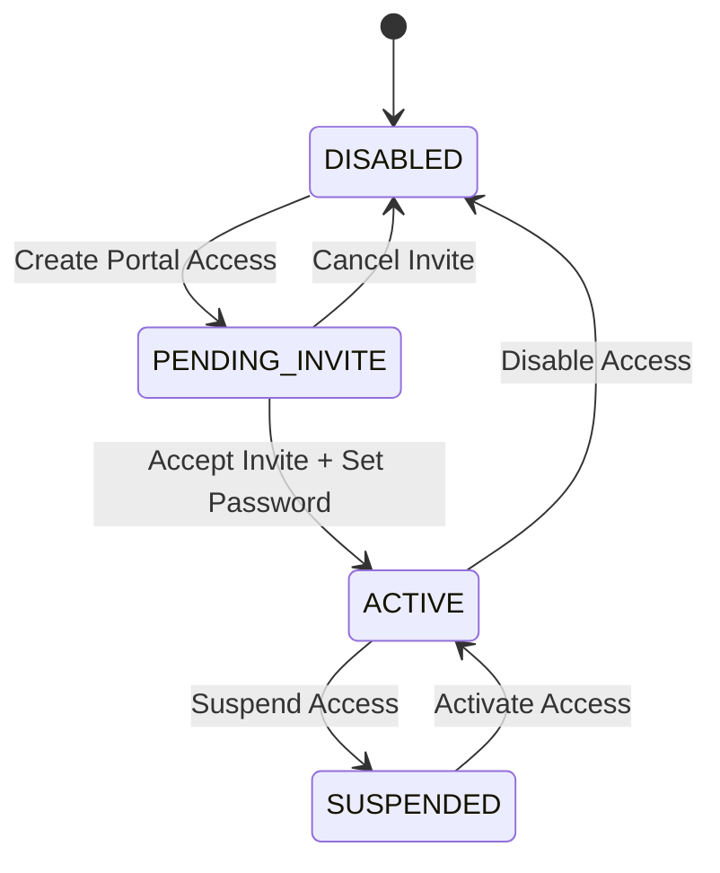

# Customer Portal Foundation Implementation

## Implementation Plan

1. Add an explicit identity boundary between internal users and customer portal users.
2. Add an authoritative portal access model with secure one-time invite tokens.
3. Route all portal context through the portal access record, never through email matching.
4. Deny portal customers from internal APIs and internal React routes by default.
5. Add admin portal access management from customer detail screens.
6. Add invite acceptance, password setup, login redirect, and portal-only routing.
7. Log portal lifecycle events in the existing audit log table.
8. Add automated policy coverage for transitions, identity detection, and internal API denial.

## Affected Surfaces

Tables:
- `users`
- `customer_portal_access`
- `customer_portal_invite_tokens`
- `audit_logs`
- `auth_identities`
- `password_reset_tokens`
- `customers`
- `customer_contacts`

Routes:
- Public: `GET /api/customer-portal/invites/preview`
- Public: `POST /api/customer-portal/invites/accept`
- Admin: `GET /api/customers/:customerId/portal-access`
- Admin: `POST /api/customers/:customerId/contacts/:contactId/portal-access`
- Admin: `POST /api/customer-portal-access/:accessId/resend-invite`
- Admin: `POST /api/customer-portal-access/:accessId/cancel-invite`
- Admin: `POST /api/customer-portal-access/:accessId/suspend`
- Admin: `POST /api/customer-portal-access/:accessId/activate`
- Admin: `POST /api/customer-portal-access/:accessId/disable`
- Admin: `POST /api/customer-portal-access/:accessId/reset-password`

Services:
- `customerPortalAccessService`
- `tenantContext`
- `portalContext`
- `localAuth`

React:
- Login redirect
- Invite acceptance page
- Auth hook
- App route tree
- Customer detail portal access panel
- Contact form cleanup for abandoned portal checkbox

Guards and Permissions:
- `tenantContext` blocks `PORTAL_CUSTOMER`.
- `/api` middleware blocks authenticated portal customers from all non-portal APIs.
- `portalContext` requires an `ACTIVE` `customer_portal_access` row.
- React route tree renders only `/portal` routes for portal customers.

## State Diagram

Invalid transitions are rejected by `assertCustomerPortalTransition`.

## Security Notes

- Portal customers do not receive `user_organizations` membership as an internal tenant authorization mechanism.
- The portal customer-to-customer link is `customer_portal_access.user_id`.
- Portal context no longer falls back from user email to customer email.
- Existing legacy `customers.user_id` links are backfilled into `customer_portal_access` as `ACTIVE`.
- Suspended, disabled, and pending portal users cannot authenticate into the portal.

## Validation

- `npm run check`
- `npx jest --runTestsByPath server/tests/customerPortalAccessPolicy.test.ts` with `NODE_OPTIONS=--max-old-space-size=8192 --experimental-vm-modules`

The repository's `npm test` script has a Windows quoting issue for `NODE_OPTIONS`, so the targeted Jest run was executed with the environment variable set directly in PowerShell.
